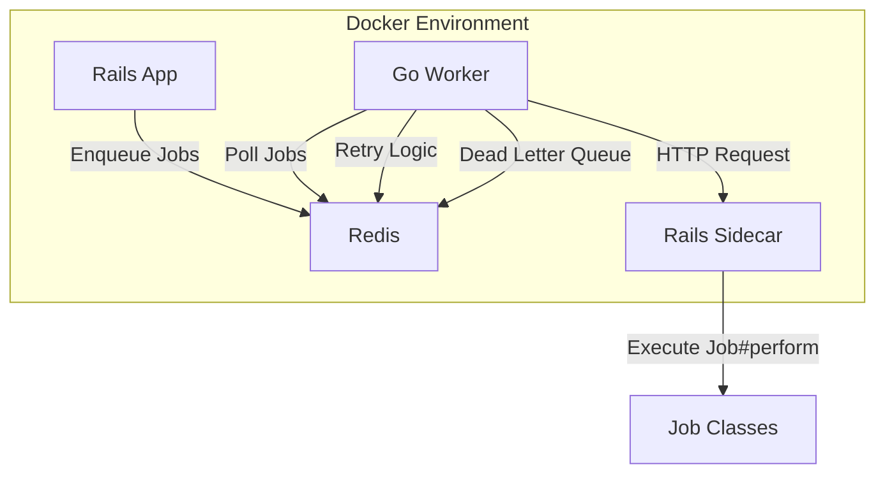

# Design Document

## Overview

The go-sidekiq system replaces Sidekiq with a Go-based worker architecture while maintaining full compatibility with existing Rails job infrastructure. The system consists of three main components: a Go worker service that polls Redis and manages job execution, a Rails sidecar service that executes job logic, and the existing Rails application that enqueues jobs. This design provides better resource utilization, improved concurrency control, and enhanced monitoring capabilities.

## Architecture



The architecture follows a producer-consumer pattern where:
- Rails app acts as the producer, enqueuing jobs to Redis
- Go worker acts as the consumer, polling Redis and orchestrating job execution
- Rails sidecar provides the execution environment for job logic
- Redis serves as both the job queue and state storage

## Components and Interfaces

### Go Worker Service

**Core Responsibilities:**
- Redis job polling and dequeuing
- Concurrency management via semaphores
- HTTP communication with Rails sidecar
- Retry logic and failure handling
- Metrics collection and health monitoring

**Key Interfaces:**
```go
type JobProcessor interface {
    ProcessJob(job *SidekiqJob) error
    RetryJob(job *SidekiqJob, attempt int) error
}

type RedisClient interface {
    PollJobs(queues []string) (*SidekiqJob, error)
    EnqueueRetry(job *SidekiqJob, delay time.Duration) error
    MoveToDLQ(job *SidekiqJob) error
}

type SidecarClient interface {
    ExecuteJob(job *SidekiqJob) (*JobResult, error)
    HealthCheck() error
}
```

**Configuration:**
- Maximum concurrency (semaphore size)
- Redis connection settings
- Sidecar endpoint URL
- Retry policies (max attempts, backoff strategy)
- Queue priorities and polling intervals

### Rails Sidecar Service

**Core Responsibilities:**
- HTTP server for job execution requests
- Job deserialization and parameter extraction
- Rails environment initialization and maintenance
- Job execution with proper error handling
- Response formatting for Go worker

**HTTP API Design:**
```
POST /jobs/execute
Content-Type: application/json

{
  "class": "MyJobClass",
  "args": [arg1, arg2, ...],
  "jid": "job-id",
  "queue": "default",
  "created_at": timestamp,
  "enqueued_at": timestamp
}

Response:
{
  "status": "success|failure",
  "result": "job result or error message",
  "execution_time": 1.23
}
```

**Health Check Endpoint:**
```
GET /health
Response: {"status": "ok", "rails_loaded": true}
```

### Redis Integration

**Job Format Compatibility:**
The system maintains Sidekiq's Redis job format for seamless integration:
```json
{
  "class": "JobClassName",
  "args": [arguments],
  "jid": "unique-job-id",
  "queue": "queue-name",
  "created_at": timestamp,
  "enqueued_at": timestamp,
  "retry": retry_count,
  "failed_at": timestamp
}
```

**Queue Structure:**
- `queue:default` - Primary job queue
- `queue:retry` - Failed jobs awaiting retry
- `queue:dead` - Jobs that exceeded retry limits
- `queue:scheduled` - Jobs scheduled for future execution

## Data Models

### SidekiqJob (Go)
```go
type SidekiqJob struct {
    Class       string        `json:"class"`
    Args        []interface{} `json:"args"`
    JID         string        `json:"jid"`
    Queue       string        `json:"queue"`
    CreatedAt   float64       `json:"created_at"`
    EnqueuedAt  float64       `json:"enqueued_at"`
    Retry       int           `json:"retry,omitempty"`
    FailedAt    float64       `json:"failed_at,omitempty"`
    ErrorMsg    string        `json:"error_message,omitempty"`
    ErrorClass  string        `json:"error_class,omitempty"`
}
```

### JobResult (Go)
```go
type JobResult struct {
    Status        string  `json:"status"`
    Result        string  `json:"result"`
    ExecutionTime float64 `json:"execution_time"`
    ErrorMessage  string  `json:"error_message,omitempty"`
}
```

### Configuration (Go)
```go
type Config struct {
    Redis struct {
        URL      string `yaml:"url"`
        Password string `yaml:"password"`
        DB       int    `yaml:"db"`
    } `yaml:"redis"`
    
    Sidecar struct {
        URL     string        `yaml:"url"`
        Timeout time.Duration `yaml:"timeout"`
    } `yaml:"sidecar"`
    
    Worker struct {
        Concurrency int           `yaml:"concurrency"`
        Queues      []string      `yaml:"queues"`
        PollInterval time.Duration `yaml:"poll_interval"`
    } `yaml:"worker"`
    
    Retry struct {
        MaxAttempts int           `yaml:"max_attempts"`
        BaseDelay   time.Duration `yaml:"base_delay"`
        MaxDelay    time.Duration `yaml:"max_delay"`
    } `yaml:"retry"`
}
```

## Error Handling

### Go Worker Error Handling
1. **Redis Connection Errors**: Implement exponential backoff reconnection
2. **Sidecar Communication Errors**: Circuit breaker pattern with fallback
3. **Job Processing Errors**: Structured retry with dead letter queue
4. **Semaphore Timeout**: Graceful degradation with monitoring alerts

### Rails Sidecar Error Handling
1. **Job Execution Errors**: Capture and return structured error responses
2. **Rails Loading Errors**: Health check failures trigger container restart
3. **HTTP Server Errors**: Proper status codes and error messages
4. **Memory/Resource Errors**: Graceful shutdown and restart mechanisms

### Retry Strategy
- **Exponential Backoff**: Base delay of 15 seconds, max delay of 24 hours
- **Jitter**: Random variation to prevent thundering herd
- **Max Attempts**: Configurable, default 25 attempts
- **Dead Letter Queue**: Failed jobs moved after max attempts exceeded

## Testing Strategy

### Unit Testing
- **Go Worker**: Mock Redis and HTTP clients for isolated testing
- **Rails Sidecar**: RSpec tests for job execution and HTTP endpoints
- **Job Processing**: Test various job types and error scenarios

### Integration Testing
- **End-to-End Flow**: Rails enqueue → Go worker → Sidecar execution
- **Failure Scenarios**: Network failures, timeouts, invalid jobs
- **Concurrency Testing**: Multiple workers, high job volumes
- **Redis Persistence**: Job state across restarts

### Performance Testing
- **Throughput Benchmarks**: Jobs per second under various loads
- **Memory Usage**: Monitor Go worker and Rails sidecar memory
- **Latency Measurements**: Job processing time distributions
- **Scalability Testing**: Multiple worker instances, queue depths

### Container Testing
- **Docker Compose**: Full stack deployment testing
- **Health Checks**: Container readiness and liveness probes
- **Network Isolation**: Service-to-service communication
- **Volume Persistence**: Redis data persistence across restarts

## Monitoring and Observability

### Metrics Collection
- **Job Metrics**: Processed, failed, retried, queue depth
- **Performance Metrics**: Processing time, throughput, latency percentiles
- **System Metrics**: Memory usage, CPU utilization, goroutine count
- **Error Metrics**: Error rates by type, circuit breaker states

### Logging Strategy
- **Structured Logging**: JSON format with consistent fields
- **Log Levels**: DEBUG, INFO, WARN, ERROR with appropriate filtering
- **Correlation IDs**: Track jobs across service boundaries
- **Performance Logs**: Execution times, queue wait times

### Health Monitoring
- **Health Endpoints**: `/health` for each service
- **Readiness Probes**: Service dependency checks
- **Liveness Probes**: Service responsiveness verification
- **Circuit Breaker Status**: Sidecar availability monitoring

## Security Considerations

### Network Security
- **Service Isolation**: Container network segmentation
- **TLS Communication**: HTTPS for sidecar communication
- **Redis Authentication**: Password-protected Redis access
- **Port Exposure**: Minimal external port exposure

### Data Security
- **Job Data**: Secure handling of sensitive job parameters
- **Logging**: Sanitize sensitive data from logs
- **Error Messages**: Avoid exposing internal system details
- **Access Control**: Service-to-service authentication

## Deployment Architecture

### Container Strategy
- **Multi-stage Builds**: Optimized container images
- **Base Images**: Security-hardened base images
- **Resource Limits**: CPU and memory constraints
- **Restart Policies**: Automatic restart on failure

### Scaling Strategy
- **Horizontal Scaling**: Multiple Go worker instances
- **Queue Partitioning**: Distribute load across workers
- **Resource Allocation**: Dynamic scaling based on queue depth
- **Load Balancing**: Distribute jobs evenly across workers