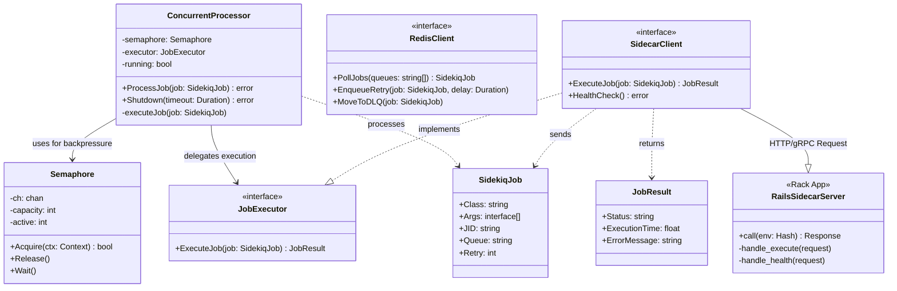

# Class & Component Diagram

This diagram illustrates the internal structure of the Gokiq Orchestrator (Go) and its relationship with the Rails Execution Sidecar.

## Component Descriptions

### Go Worker (Orchestrator)
- **ConcurrentProcessor**: The heart of the system. It manages the lifecycle of job execution, ensuring we don't exceed the configured concurrency.
- **Semaphore**: A channel-based implementation that provides natural backpressure. It prevents the worker from fetching more jobs from Redis if the execution sidecar is at capacity.
- **RedisClient**: A robust Redis wrapper that handles Sidekiq-compatible job polling (BLPOP) and retry scheduling (ZADD).
- **SidecarClient**: Handles the bridge communication to the Ruby environment. It supports both HTTP/1.1 (Falcon) and gRPC.

### Rails Sidecar (Executor)
- **Server (Rack/Falcon)**: A non-blocking web server that receives job payloads, interacts with the Rails environment, and returns execution results.
- **Async Fibers**: Within the sidecar, each job runs in its own Fiber, allowing high IO concurrency without the memory overhead of OS threads.

### Shared Data Types
- **SidekiqJob**: JSON-compatible structure following the Sidekiq protocol.
- **JobResult**: Standardized execution outcome used to determine if a job should be acknowledged or retried.
