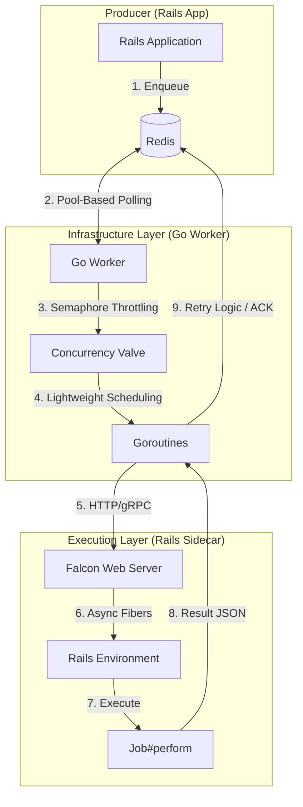

# Gokiq: High-Performance Sidekiq Orchestrator

Gokiq is a specialized background job orchestrator written in Go, designed to replace the standard Sidekiq worker infrastructure while remaining 100% compatible with existing Rails job enqueuing.

It uses a **decoupled architecture**: a high-concurrency Go worker handles job orchestration (polling, retries, backpressure), while a lightweight Ruby "Sidecar" executes the actual Rails job logic using the Fiber-based **Falcon** web server.

## 🚀 Key Advantages

| Feature | Standard Sidekiq | Gokiq (Go + Falcon) | Why it matters |
| :--- | :--- | :--- | :--- |
| **Concurrency** | OS Threads (1-2MB/thread) | Goroutines (2KB/job) | 10-100x more concurrent jobs on same RAM. |
| **Backpressure** | Hard to control | Native Go Semaphores | Prevents DB "death spirals" during spikes. |
| **IO Handling** | Thread Blocking | Fiber/Event-based IO | Ruby GVL doesn't block job orchestration. |
| **Redis Load** | High (Pool per process) | Low (Unified Go Pool) | Reduces Redis CPU and connection overhead. |
| **Isolation** | Single process crash | Fault-tolerant bridge | A memory leak in Ruby won't stop job polling. |

## 🏗 Architecture



## 📂 Project Structure

- `go_worker/`: The Orchestrator core (Go). Handles Redis, concurrency, and retries.
- `rails_sidecar/`: The Execution bridge (Ruby/Falcon). Executes your Rails code.
- `rails_app/`: Example application with sample jobs.
- `proto/`: gRPC definitions for high-performance bridge communication.
- `docker-compose.yml`: Full stack orchestration.

## 🛠 Getting Started

1.  **Configure Environment**: Edit `.env` to set your desired concurrency.
    ```env
    WORKER_CONCURRENCY=500
    SIDEKIQ_CONCURRENCY=10
    ```

2.  **Spin up the stack**:
    ```bash
    docker-compose up --build
    ```

3.  **Run Benchmarks**:
    Compare Gokiq vs Standard Sidekiq:
    ```bash
    ruby run_benchmark.rb
    ```

## 📖 Documentation

- [Detailed Architecture](./architecture_go_falcon.md)
- [Class & Component Diagram](./CLASS_DIAGRAM.md)
- [Sidekiq Comparison](./architecture_sidekiq.md)

---

Developed for high-throughput Rails environments where performance and reliability are paramount.
