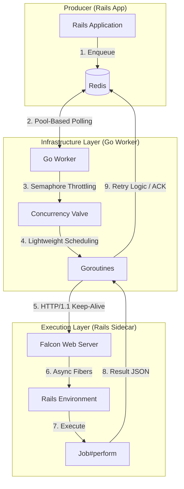

# Gokiq Architecture: In-Depth

Gokiq represents a "Decoupled" approach to background processing. It separates the **Infrastructure (scheduling, networking, backpressure)** from the **Application Logic (Rails code)**.

## Architecture Diagram

## Detailed Internal Mechanics

### 1. Go's M:N Scheduler (The Orchestrator)
The Go worker does not use OS threads for concurrency. It uses **Goroutines**.
*   **Efficiency:** A Goroutine starts with only **2KB of stack memory**, whereas a Ruby thread starts with **~1MB-2MB**.
*   **M:N Scheduling:** Go schedules thousands of goroutines onto a small number of actual CPU cores (M goroutines on N threads). This allows the Go worker to handle 10,000 concurrent "waiting" jobs with the same CPU usage as 10 Ruby threads.

### 2. Falcon's Fiber-Based Execution
The Sidecar uses **Falcon**, a non-blocking web server.
*   **Fibers vs Threads:** Falcon uses Ruby Fibers (via the `async` gem). Unlike threads, fibers are cooperatively scheduled. This allows a single Ruby process to handle hundreds of concurrent HTTP requests (jobs) with zero GVL contention during IO.
*   **Shared Memory:** Falcon loads the Rails environment once and forks worker processes. This utilizes **Copy-on-Write (CoW)** effectively, allowing workers to share the memory used by the Rails framework.

### 3. Semaphore-Based Backpressure
In Sidekiq, you can't easily stop the worker from fetching jobs if the database is slow. In Go, we use a **Channel-based Semaphore**.
*   **Natural Backpressure:** The Go worker only pulls a job from Redis when a semaphore slot is available. If the Rails Sidecar slows down, the Go worker automatically stops polling Redis, protecting the database from a "death spiral."

### 4. Fault Isolation
The "Scheduler" (Go) and "Executor" (Ruby) are separate processes.
*   **Resilience:** If a Ruby job causes a memory leak or a crash, only the **Execution Sidecar** is affected. The Go Orchestrator remains perfectly healthy, logs the error, and can immediately restart the sidecar or requeue the job.

## Pros & Cons

### Pros
*   **Ultra-High Density:** Handle 10x more concurrent jobs on the same RAM budget.
*   **Redis Protection:** Single, stable connection pool regardless of job volume.
*   **Observability:** Fine-grained metrics from Go about bridge latency and sidecar health.
*   **Infrastructure Safety:** Impossible for a "bad job" to take down the job-polling infrastructure.

### Cons
*   **Architectural Overhead:** You now manage a Go binary and a Ruby server.
*   **Latency:** The HTTP/1.1 jump adds ~1-2ms of overhead per job (negligible for jobs > 10ms).

## Scalability Comparison: Why Go + Falcon Wins

| Factor | Sidekiq | Go + Falcon | Technical Reason |
| :--- | :--- | :--- | :--- |
| **Concurrency** | OS Threads (Heavy) | Goroutines (Light) | Go's 2KB stack vs Ruby's 2MB stack. |
| **Backpressure** | Push-based (Hard) | Pull-based (Easy) | Go Semaphores decouple polling from execution. |
| **Redis Load** | High (Pool/Process) | Low (Single Pool) | Go multiplexes many tasks over few connections. |
| **Memory** | Linear Growth | Constant Infrastructure | Go RAM usage is flat; Ruby RAM is shared via CoW. |

**Final Verdict:** Go + Falcon is the superior choice for high-throughput, mission-critical Rails applications that need to process millions of jobs with maximum reliability and minimum hardware cost.
