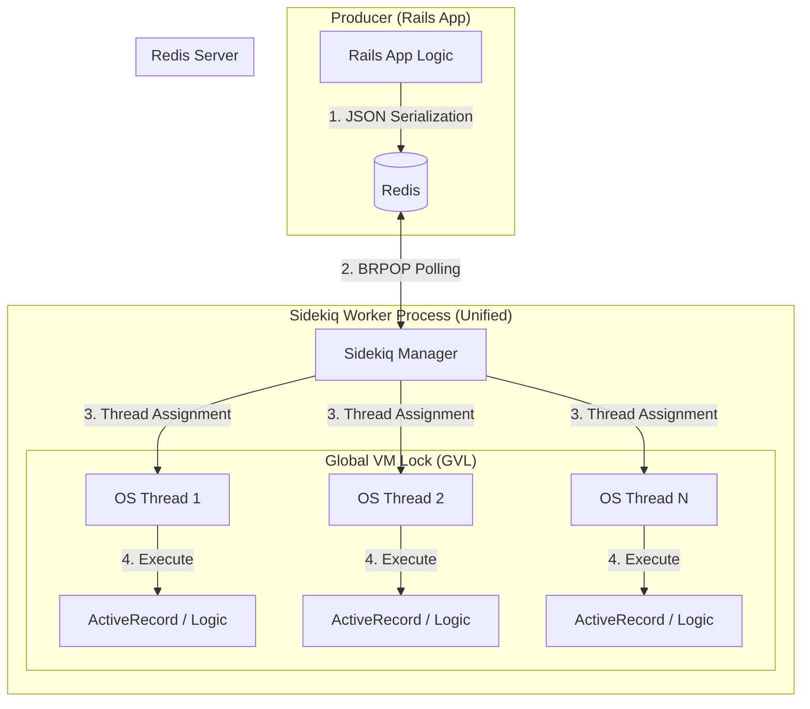

# Standard Sidekiq Architecture: In-Depth

Standard Sidekiq is the de-facto background processing framework for Ruby on Rails. It is built on a "unified" architecture where the logic for fetching jobs and the logic for executing them live in the same Ruby process.

## Architecture Diagram

## Detailed Internal Mechanics

### 1. The Multi-Threading Model & GVL
Sidekiq uses OS-level threads to achieve concurrency. However, in MRI (Matz's Ruby Interpreter), the **Global VM Lock (GVL)** ensures that only one thread can execute Ruby bytecode at any given time.
*   **The Bottleneck:** While threads can run in parallel during IO operations (like waiting for a database response), they are strictly sequential for CPU-bound tasks.
*   **Context Switching:** Managing hundreds of OS threads introduces high overhead for the Linux kernel, as it must constantly swap thread contexts, leading to CPU cache misses.

### 2. Redis Interaction (The BRPOP Strategy)
Sidekiq uses the `BRPOP` command to poll Redis. 
*   **Connection Bloat:** Each Sidekiq process requires a connection pool sized to its thread count. If you have 10 processes with 25 threads each, you are maintaining 250+ persistent connections to Redis.
*   **Polling Overhead:** At high scale, thousands of Ruby threads waiting on Redis lists can cause significant CPU spikes on the Redis server itself due to the sheer number of active TCP sockets.

### 3. Memory Architecture
Because the worker is a full Rails environment, it loads every gem, initializer, and model in your app.
*   **Copy-on-Write (CoW) Limitations:** While modern Sidekiq attempts to use forking, most installations run as single long-lived processes where memory fragmentation eventually leads to "bloat," requiring process restarts.

## Pros & Cons

### Pros
*   **Zero-Configuration:** Drop the gem in, and it works.
*   **Shared Memory Space:** Jobs can access global constants and cached data instantly.
*   **Feature Rich:** Includes built-in support for retries, scheduling, and a powerful Web UI.

### Cons
*   **High Cost per Slot:** Every concurrent "slot" is an OS thread, which is memory and CPU intensive.
*   **Single Point of Failure:** A memory leak in a single job eventually consumes the entire worker's memory, affecting every other concurrent job.
*   **Vertical Scaling Only:** To scale, you must add more RAM to your servers to support more heavy Ruby processes.

## Scalability Analysis
Standard Sidekiq is **IO-bound and RAM-bound**. It excels in small to medium applications but becomes an infrastructure bottleneck in "High-Density" environments where you need to process thousands of jobs per second across thousands of queues.
